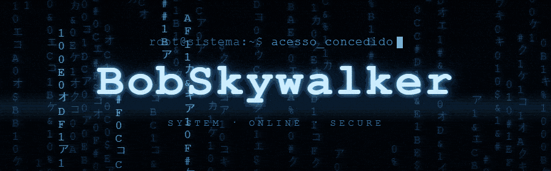

<div align="center">



# 🚀 `BOBSKYWALKER`

### `> PROGRAMADOR EM FORMAÇÃO • TÉCNICO DE CELULARES EM FORMAÇÃO`

<br>

[](https://github.com/BobSkywalker)
[](#)
[](#)

</div>

---

## 👋 `01 // SOBRE MIM`

```text
╭──────────────────────────────────────────────────────────────╮
│                                                              │
│  👨‍💻 Olá! Eu sou BobSkywalker.                              │
│                                                              │
│  🚀 Estou construindo minha jornada na tecnologia,          │
│  estudando programação e manutenção de celulares.            │
│                                                              │
│  💻 Na programação, estou desenvolvendo meus conhecimentos   │
│  em desenvolvimento web, lógica e JavaScript.                │
│                                                              │
│  📱 Na área técnica, estou aprendendo sobre manutenção,     │
│  diagnóstico, componentes e reparo de dispositivos móveis.   │
│                                                              │
│  📚 Ainda estou aprendendo e tenho muito para evoluir.       │
│                                                              │
╰──────────────────────────────────────────────────────────────╯
```

> 💡 **Meu objetivo não é saber tudo. É aprender um pouco mais todos os dias.**

---

## 💻 `02 // PROGRAMAÇÃO`

<div align="center">

### 🛠️ Tecnologias


</div>

### 📚 Meu nível atual

```text
┌─────────────────────────────────────────────────────────────┐
│ 💻 PROGRAMMING                                              │
├─────────────────────────────────────────────────────────────┤
│                                                             │
│ 🌐 HTML5              🟢 ESTUDADO / PRATICANDO              │
│ 🎨 CSS3               🟢 ESTUDADO / PRATICANDO              │
│ ⚡ JavaScript         🟡 EM APRENDIZADO                     │
│ 🧠 Lógica             🟡 EM DESENVOLVIMENTO                 │
│ 🌎 Web Development    🟡 EM APRENDIZADO                     │
│ 🐙 Git / GitHub       🟡 APRENDENDO                         │
│                                                             │
└─────────────────────────────────────────────────────────────┘
```

> ⚠️ **Os status representam meu momento atual de aprendizado, não domínio completo das tecnologias.**

---

## 📱 `03 // TÉCNICO DE CELULARES`

```text
┌─────────────────────────────────────────────────────────────┐
│ 📱 MOBILE TECH                                              │
├─────────────────────────────────────────────────────────────┤
│                                                             │
│ 🔧 Manutenção            🟡 EM APRENDIZADO                  │
│ 🔍 Diagnóstico           🟡 EM APRENDIZADO                  │
│ 🧩 Componentes           🟡 ESTUDANDO                       │
│ ⚡ Eletrônica básica     🟡 ESTUDANDO                       │
│ 🔬 Diagnóstico de placa  🟠 PRÓXIMO NÍVEL                   │
│ 🛠️ Reparo de placas      ⚪ FUTURO OBJETIVO                 │
│                                                             │
└─────────────────────────────────────────────────────────────┘
```

> 📱 **A área técnica também está em constante aprendizado. Cada aparelho, defeito e reparo é uma oportunidade para aprender algo novo.**

---

## 🎯 `04 // ROADMAP`

### 💻 Programação

```text
🟢 HTML5
   └── 📚 Conhecimento em desenvolvimento

🟢 CSS3
   └── 📚 Conhecimento em desenvolvimento

🟡 JavaScript
   └── 🚀 Aprofundar conhecimentos

🟡 Lógica de programação
   └── 🧠 Continuar praticando

🟡 Desenvolvimento Web
   └── 💻 Criar projetos cada vez mais completos

⚪ Novas tecnologias
   └── 🔮 Explorar futuramente
```

### 📱 Mobile Tech

```text
🟡 Manutenção de celulares
   └── 🔧 Continuar adquirindo experiência

🟡 Diagnóstico
   └── 🔍 Melhorar identificação de defeitos

🟡 Componentes eletrônicos
   └── 🧩 Aprofundar conhecimentos

🟡 Eletrônica
   └── ⚡ Fortalecer a base

🟠 Diagnóstico de placas
   └── 🔬 Aprofundar futuramente

⚪ Reparo avançado
   └── 🛠️ Objetivo de longo prazo
```

---

## 🧪 `05 // PROJETOS`

Este perfil é meu espaço para registrar **projetos, estudos, experimentos e minha evolução**.

```text
📁 BOBSKYWALKER
│
├── 💻 web/
│   ├── 🌐 html/
│   ├── 🎨 css/
│   └── ⚡ javascript/
│
├── 📱 mobile/
│   ├── 📚 estudos/
│   ├── 🔍 diagnosticos/
│   └── 🔧 manutencao/
│
├── 🧪 experiments/
│   └── 💡 projetos/
│
└── 📖 studies/
    └── 📝 anotações/
```

### 🚧 O que você encontrará por aqui

* 🌐 Projetos web
* 🧪 Experimentos
* 📚 Estudos
* 💡 Ideias
* 🔧 Projetos relacionados à área técnica
* 📈 Registro da minha evolução

---

## 📈 `06 // EVOLUÇÃO`

```text
╭──────────────────────────────────────────────────────────────╮
│                                                              │
│  📚 APRENDER                                                │
│       ↓                                                      │
│  🧠 ENTENDER                                                │
│       ↓                                                      │
│  💻 PRATICAR                                                │
│       ↓                                                      │
│  🧪 EXPERIMENTAR                                            │
│       ↓                                                      │
│  ❌ ERRAR                                                    │
│       ↓                                                      │
│  🔧 CORRIGIR                                                │
│       ↓                                                      │
│  🚀 EVOLUIR                                                 │
│       ↓                                                      │
│  🔁 REPETIR                                                 │
│                                                              │
╰──────────────────────────────────────────────────────────────╯
```

> 🔥 **Não estou tentando parecer que já cheguei lá. Estou construindo o caminho até lá.**

---

## 🎯 `07 // OBJETIVOS`

### 💻 Programação

* 🧠 Aprofundar JavaScript
* 🌐 Criar projetos web completos
* 🧩 Melhorar minha lógica de programação
* 🐙 Aprender Git e GitHub cada vez mais
* 🚀 Explorar novas tecnologias
* 💼 Me tornar um programador profissional

### 📱 Tecnologia Mobile

* 🔍 Melhorar meu diagnóstico de defeitos
* 🔧 Aumentar minha experiência em manutenção
* 🧩 Conhecer melhor os componentes
* ⚡ Aprofundar eletrônica
* 🔬 Aprender diagnóstico de placas
* 🛠️ Evoluir nos reparos
* 💼 Me tornar um técnico de celulares profissional

---

## 🧠 `08 // FILOSOFIA`

<div align="center">

```text
LEARN 📚
   ↓
PRACTICE 💻
   ↓
BUILD 🛠️
   ↓
FAIL ❌
   ↓
FIX 🔧
   ↓
IMPROVE 🚀
   ↓
REPEAT 🔁
```

### `> EVOLUTION IS BUILT ONE STEP AT A TIME.`

</div>

---

## 🐙 `09 // GITHUB`

<div align="center">

### `> MY CODE • MY PROJECTS • MY EVOLUTION`

<br>

[](https://github.com/BobSkywalker)

</div>

---

## 🤝 `10 // CONTRIBUIÇÃO`

Este perfil é principalmente um espaço de **aprendizado e evolução**.

💡 Sugestões, ideias e feedbacks construtivos são sempre bem-vindos.

```bash
$ git clone https://github.com/BobSkywalker

$ cd BobSkywalker

$ git checkout -b feature/nova-ideia

$ git commit -m "feat: nova evolução"

$ git push origin feature/nova-ideia
```

---

## 👨‍💻 `11 // AUTOR`

<div align="center">

### **Nicolas Lopes**

`💻 Programador em formação`

`📱 Técnico de celulares em formação`

`🚀 Entusiasta de tecnologia`

<br>

[](https://github.com/BobSkywalker)

</div>

---

<div align="center">

```text
╔══════════════════════════════════════════════════════════════╗
║                                                              ║
║  🟢 SYSTEM STATUS    : ONLINE                                ║
║  📚 LEARNING         : ACTIVE                                ║
║  💻 PROGRAMMING      : IN PROGRESS                           ║
║  📱 MOBILE TECH      : IN PROGRESS                           ║
║  🧪 PROJECTS         : BUILDING                              ║
║  🚀 EVOLUTION        : CONSTANT                              ║
║  🎯 GOAL             : PROFESSIONAL                          ║
║                                                              ║
╚══════════════════════════════════════════════════════════════╝
```

### `> 🚀 BUILDING MY FUTURE, ONE STEP AT A TIME.`

</div>
